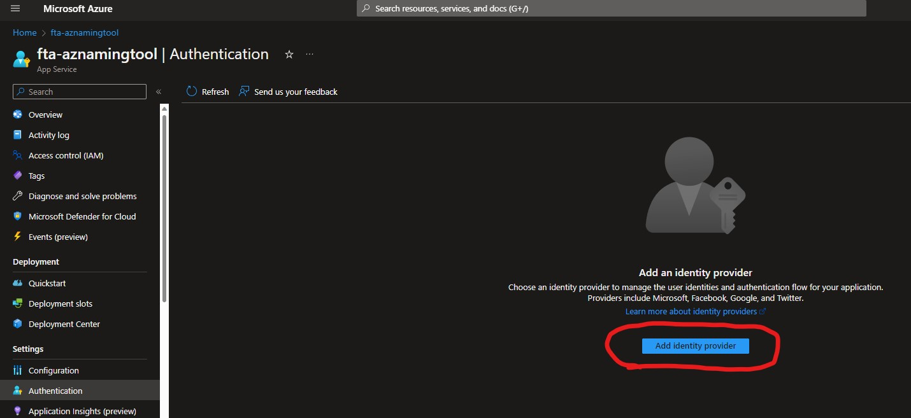
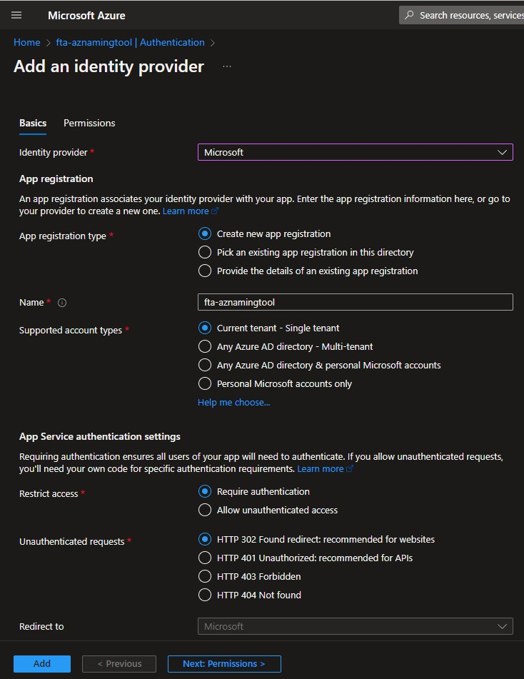
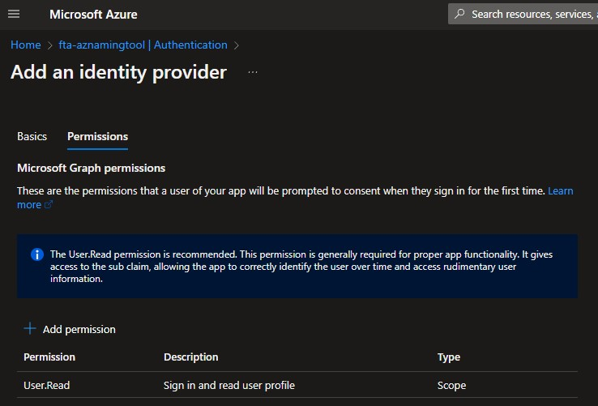
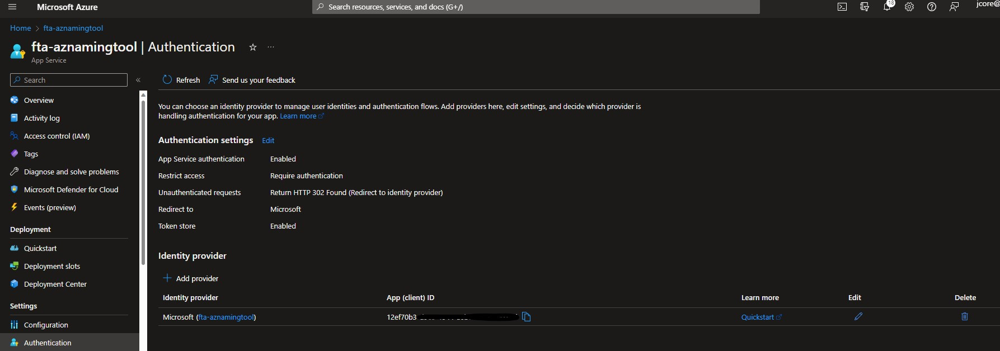
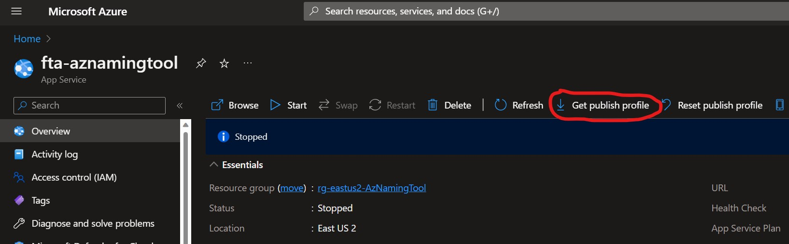
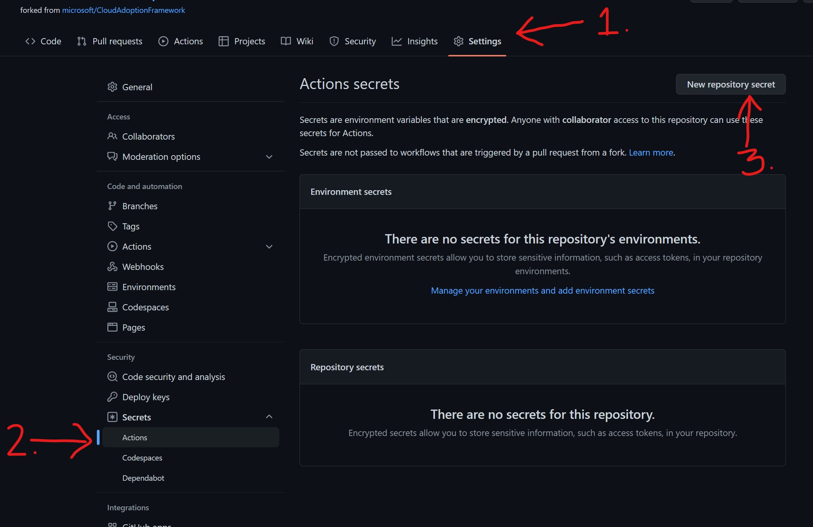
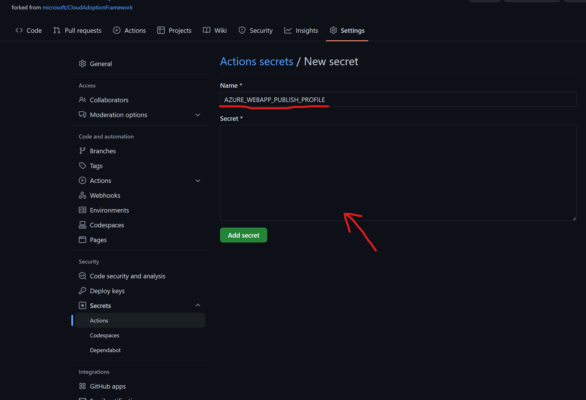
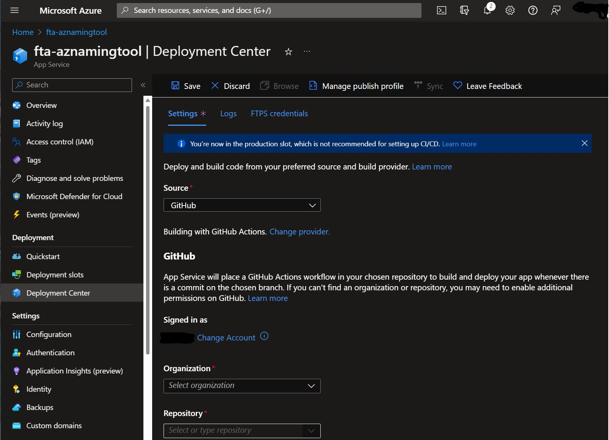

# How to Deploy to Azure

## As a Web Application (Website)

The deployment will simply create a Web Application within your subscription and require at least the Contributor role at that level. Be aware it will initially be publicly accessible until you follow step number 2 below.

### 1. Deploy an Empty Web App in Azure

Utilize the button below and fill in the required information.  
[](https://portal.azure.com/#create/Microsoft.Template/uri/https%3A%2F%2Fraw.githubusercontent.com%2Fmicrosoft%2FCloudAdoptionFramework%2Fmain%2Fready%2FAzNamingTool%2FDeployments%2FAppService-WebApp%2Fsolution.json)
[](https://portal.azure.us/#create/Microsoft.Template/uri/https%3A%2F%2Fraw.githubusercontent.com%2Fmicrosoft%2FCloudAdoptionFramework%2Fmain%2Fready%2FAzNamingTool%2FDeployments%2FAppService-WebApp%2Fsolution.json)

### 2. After deployment TURN ON AUTHENTICATION

**This will ensure Azure AD logon is required for access.**

Navigate to the App Service that will be named '\<companyname\>-aznamingtool' and click on 'Authentication' and then 'Add Identity Provider'.  


Select the Identity Provider Option which for Azure AD would be Microsoft. The defaults will ensure authentication is required in the current Azure AD tenant.  


The default permissions for simple read are sufficient and typically the default.  


Once completed you should see the newly added Authentication method added and browsing to the Web App should now prompt for Authentication and allow access via your Azure AD credentials.  


### 3. Fork the [Github repository with the Azure Naming tool](https://github.com/microsoft/CloudAdoptionFramework/tree/master/ready/AzNamingTool) to your own Github repository

Simply select the 'Fork' option and create a new fork to your repository.  


### 4. Setup the Secret required to publish the app to your Web App

**Script Option:**
```PowerShell
Get-AzWebApp -Name <webappname> | Get-AzWebAppPublishingProfile -OutputFile <filenmae> | Out-Null
```

**Portal Option:**  
First navigate to the Web App in the Azure Portal and click the button to Get publishing profile. Simply open the downloaded file with notepad and copy the contents to the clipboard.  


Then navigate to your GitHub forked Repository and select Settings, then expand Secrets and select Actions. Finally select the 'New repository secret' button.  


Ensure the name of the Secret is exactly as it appears here and paste in the contents of the file from the previous step.  
Name must be: **AZURE_WEBAPP_PUBLISH_PROFILE**  


### 5. Verify the code is updated to the web app and you can navigate to the deployed Azure Naming Tool

Restart the Web App and then the web app URL should be accessible with the initial Azure Naming Tool prompt for the Admin password appearing after authenticating into Azure AD.  
(companyName-aznamingtool.azurewebsites.net)  
You can navigate to the Web App in the Azure Portal and the URL should be listed in the Overview section on the right side.  You can also click on the 'Deployment Center' and then the 'Logs' tab for troubleshooting any issues with the code not being pushed to the Web App.

### 6. (OPTIONAL) Configure the Web App to pull the Azure Naming tool code to your Web App

This step will push any changes to your GitHub immediately to the Web App but not interfere or remove existing customizations or data. Thus updating the application would be as simple as opening your GitHub fork and pulling changes from the Microsoft source repository.  

Navigate to the Web App within the Azure Portal. Click on the 'Deployment Center' option within the left pane. Then select 'GitHub' as the Source and provide the necessary information for your GitHub repository.  
