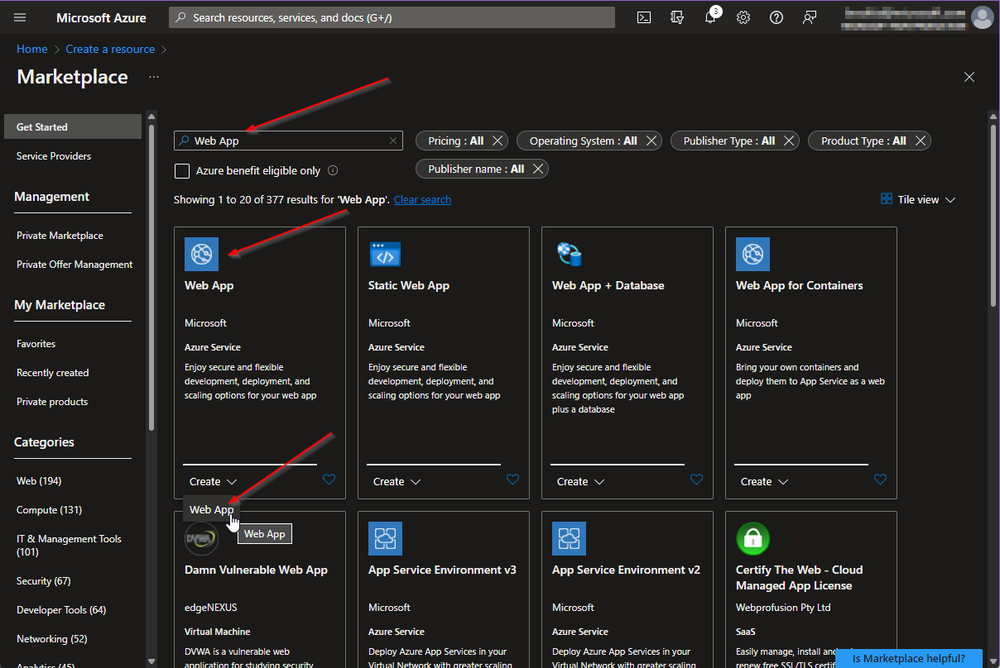
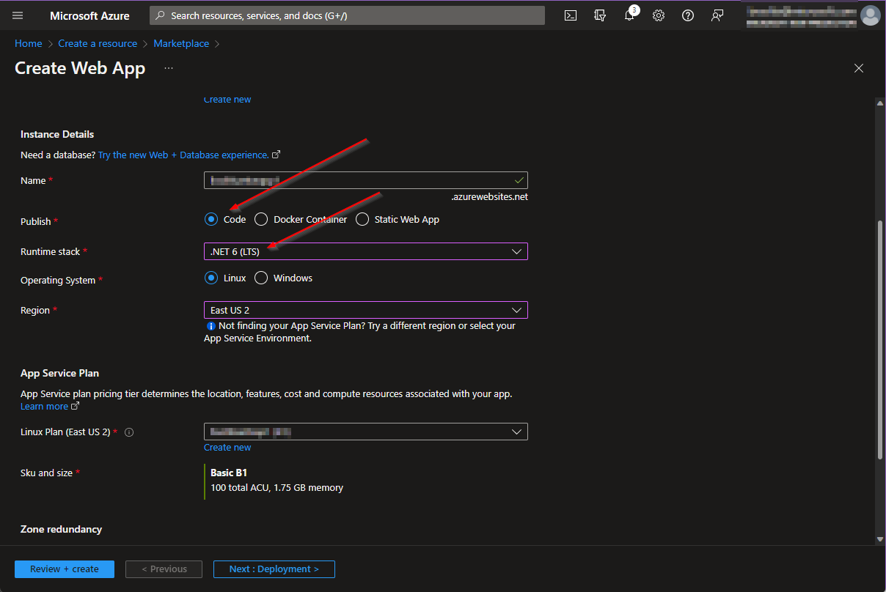
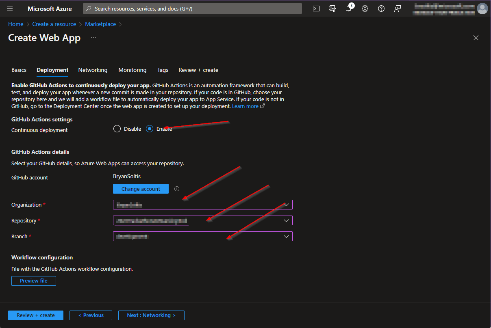
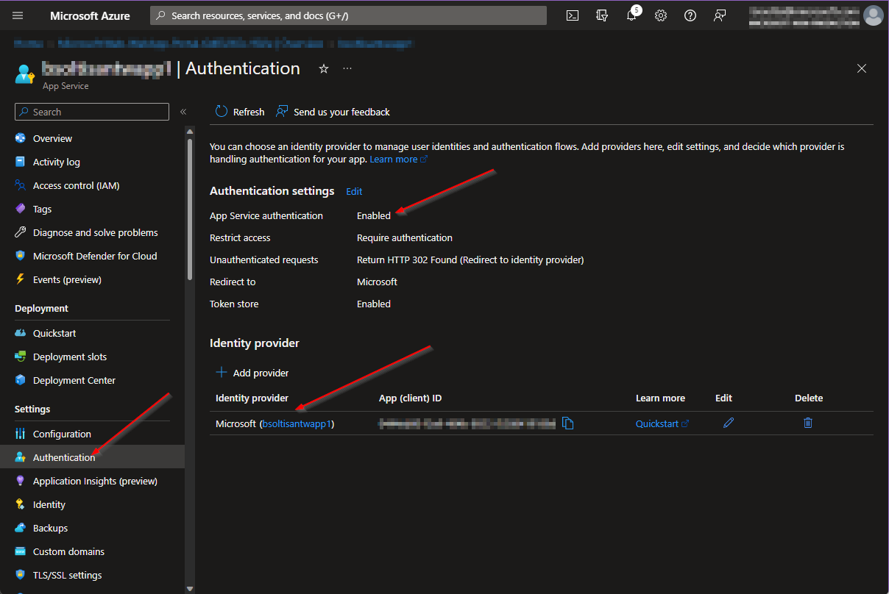
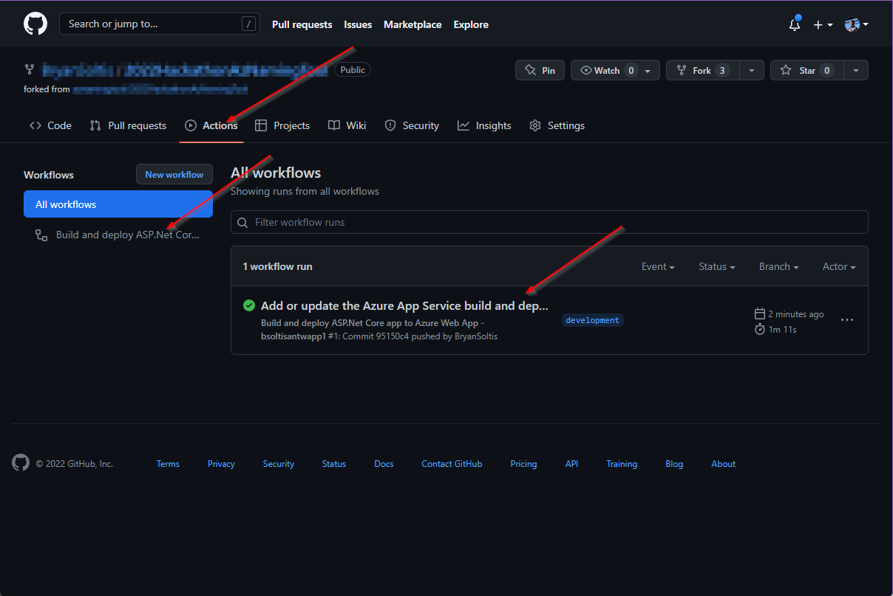
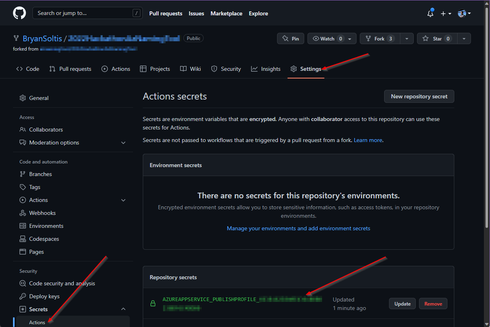
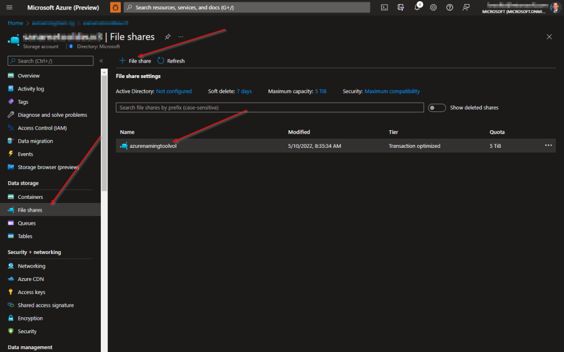
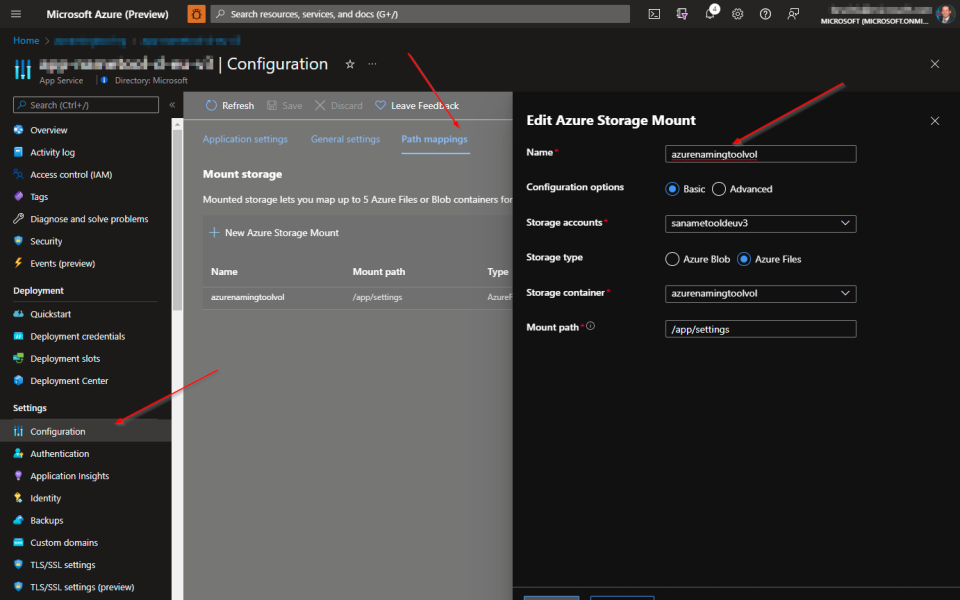

[Overview](./) | [Installation](INSTALLATION.md) | [Updating](UPDATING.md) | [Using the API](USINGTHEAPI.md) | [Version History](VERSIONHISTORY.md) | [FAQ](FAQ.md) 

# Azure Naming Tool v2 - Installation


[Choosing an Installation Option](#choosing-an-installation-option)

[How To Install](#how-to-install)

* [Run as a Docker image](#run-as-a-docker-image) (Local development)

* [Run as an Azure App Service](#run-as-an-azure-app-service) (.NET Application running in an Azure App Service, non-container)

* [Run as a Web App for Containers](#run-as-a-web-app-for-containers) (Single container running in an Azure App Service)

* [Run as an Azure Container App](#run-as-an-azure-container-app) (Single container running in an Azure Container App)

* [Run as a Stand-Alone Site](#run-as-a-stand-alone-site) 

## Choosing An Installation Option
The Azure Naming Tool was designed to be deployed in nearly any environment. This includes as a stand-alone application, or as a container. Each deployment option offers pros/cons, depending on your environment and level of experience. Here is a break-down of the deployment options:

* **Docker**
  * Ideal for local deployments
  * Requires docker engine installed in environment
  * Requires storage volume mount

* **Azure App Service**
  * Ideal for fastest deployment
  * Requires Azure App Service
  * Can be integrated for continuous deployment from GitHub

* **Web App for Container**
  * Ideal for single container installations
  * Requires Azure App Service
  * Requires Azure Storage account / Azure Files Fileshare for persistent storage 

* **Azure Container App**
  * Ideal for multiple container installations (integration with other containers, services, etc.)
  * Requires Azure Container App
  * Requires Azure Storage account / Azure Files Fileshare for persistent storage 

* **Stand-alone site**
  * Ideal for legacy deployments
  * Requires web server deployment (IIS, Apache, etc.)

## How To Install

This project contains a .NET 6 application, with Docker support. To use, complete the following:

> **NOTE:**
> The Azure Naming Tool requires persistent storage for the configuration files when run as a container. The following processes will explain how to create this volume in your respective environment. All configuration JSON files will be stored in the volume to ensure the configuration is persisted.

### Run as a Docker image

This process will allow you to deploy the Azure Naming Tool using Docker to your local environment.

1. Scroll up to the top, left corner of this page.
2. Click on the **CloudAdoptionFramework** link to open the root of this repository.
3. Click the green **<>Code** button and select **Download ZIP**.
4. Open your Downloads folder using File Explorer.
5. Extract the contents of the ZIP archive.

> **NOTE:**
> Validate the project files extracted successfully and match the contents in the GitHub repository.

6. Open a **Command Prompt**
7. Change the directory to the **AzNamingTool** folder. For example:

```cmd
cd .\Downloads\CloudAdoptionFramework-master\CloudAdoptionFramework-master\ready\AzNamingTool
```

8. Run the following **Docker command** to build the image:

```cmd
docker build -t azurenamingtool .
```
  
> **NOTE:**
> Ensure the '.' is included in the command

9. Run the following **Docker command** to create a new container and mount a new volume:

```cmd
docker run -d -p 8081:80 --mount source=azurenamingtoolvol,target=/app/settings azurenamingtool:latest
```

> **NOTES:**  
> * Substitute 8081 for any port not in use on your machine
> * You may see warnings in the command prompt regarding DataProtection and keys. These indicate that the keys are not persisted and are only local to the container instances.

10. Access the site using the following URL: *http://localhost:8081*
  
> **NOTE:**
> Substitute 8081 for the port you used in the docker run command

***
### Run as an Azure App Service

(.NET application, non-container)

This process will allow you to deploy the Azure Naming Tool as a .NET application in an Azure App Service. This is the fastest deployment option and allows you to deploy and utilize your installation in minutes. This process includes creating a fork of the repository, then creatin an Azure App Service with direct integration to your repo. This will create a GitHub Action to deploy your repository code on every commit. 

1. Scroll up to the top, left corner of this page.
2. Click on the **CloudAdoptionFramework** link to open the root of this repository.
3. Click the **Fork** option in the top right menu.
4. Select your desired **Owner** and **Repository name** and click **Create fork**.
5. In the Azure Portal, create a new resource.
6. Search for **Web App** and select **Create**.

   

8. On the **Create** tab, select the following options:

     

  - RuntimeStack: **.NET 6 (LTS)**
  - Operating Systems: **Linux** (For lowest cost)
9. Select desired options for all other settings and click **Next**.
10. On the **Deployment** tab, select the following options:

     

  - Continuous deployment: **Enable**
  - Authenticate to your GitHub account
  - Organization: **Your desired organization**
  - Repository: **Your desired repository**
  - Branch: **Your desired branch** 
11. Click **Review + create**.
12. After the site is deployed, it is recommended that you enable Authentication on the app service. Choose your desired identity provider to ensure only authorized users can access your site.

     

13. In your GitHub repo, select the **Actions** tab.
14. Review the new GitHub Action workflow definition file.

     

15. On your **Settings** tab, review the new **Secret* value for your deployment.

     

16. Access the site using your Azure App Service URL

> **NOTE:**
> It is recommended that you enable authentication on your Container App to prevent un-authorized access. [Authentication and authorization in Azure Container Apps](https://docs.microsoft.com/en-us/azure/container-apps/authentication)

***

### Run as a Web App for Containers
(App Service running a container)

The Azure Naming Tool requires persistent storage for the configuration files when run as a container. The following processes will explain how to create this volume for your Azure App Service Container. All configuration JSON files will be stored in the volume to ensure the configuration is persisted.

> **NOTE:**
> For many of the steps, a sample process is provided, however, there are many ways to accomplish each step.

1. Scroll up to the top, left corner of this page.
2. Click on the **CloudAdoptionFramework** link to open the root of this repository.
3. Click the green **<>Code** button and select **Download ZIP**.
4. Open your Downloads folder using File Explorer.
5. Extract the contents of the ZIP archive.

> **NOTE:**
> Validate the project files extracted successfully and match the contents in the GitHub repository.

6. Open a **Command Prompt**
7. Change the directory to the **AzNamingTool** folder. For example:

```cmd
cd .\Downloads\CloudAdoptionFramework-master\CloudAdoptionFramework-master\ready\AzNamingTool
```

8. Run the following **Docker command** to build the image:

```cmd
docker build -t azurenamingtool .
```
  
> **NOTE:**
> Ensure the '.' is included in the command
  
9. Create an Azure Container Registry: [Microsoft Docs reference](https://docs.microsoft.com/en-us/azure/container-registry/container-registry-get-started-portal#:~:text=%20Quickstart%3A%20Create%20an%20Azure%20container%20registry%20using,must%20log%20in%20to%20the%20registry...%20More%20)
10. Build and publish your image to the Azure Container Registry: [Microsoft Docs reference](https://docs.microsoft.com/en-us/azure/container-registry/container-registry-get-started-docker-cli?tabs=azure-cli)
11. Create an Azure Files file share for persistent storage: [Microsoft Docs reference](https://docs.microsoft.com/en-us/azure/storage/files/storage-how-to-create-file-share?tabs=azure-portal)
  
  

12. Create an Azure App Service - Web App: [Microsoft Docs reference](https://docs.microsoft.com/en-us/azure/app-service/quickstart-custom-container?tabs=dotnet&pivots=container-linux)
13. Mount the file share as local storage for the Azure App Service: [Microsoft Docs reference](https://docs.microsoft.com/en-us/azure/app-service/configure-connect-to-azure-storage?tabs=portal&pivots=container-linux)
  
  

14. Deploy the image from the Azure Container Registry to the Azure App Service: [Microsoft Docs reference](https://docs.microsoft.com/en-us/azure/app-service/deploy-ci-cd-custom-container?tabs=acr&pivots=container-linux)
15. Access the site using your Azure App Service URL

> **NOTE:**
> It is recommended that you enable authentication on your Container App to prevent un-authorized access. [Authentication and authorization in Azure Container Apps](https://docs.microsoft.com/en-us/azure/container-apps/authentication)

***

### Run as an Azure Container App

The Azure Naming Tool requires persistent storage for the configuration files when run as a container. The following processes will explain how to create this volume for your Azure App Service Container. All configuration JSON files will be stored in the volume to ensure the configuration is persisted.

> **NOTE:**
> For many of the steps, a sample process is provided, however, there are many ways to accomplish each step.

1. Scroll up to the top, left corner of this page.
2. Click on the **CloudAdoptionFramework** link to open the root of this repository.
3. Click the green **<>Code** button and select **Download ZIP**.
4. Open your Downloads folder using File Explorer.
5. Extract the contents of the ZIP archive.

> **NOTE:**
> Validate the project files extracted successfully and match the contents in the GitHub repository.

6. Open a **Command Prompt**
7. Change the directory to the **AzNamingTool** folder. For example:

```cmd
cd .\Downloads\CloudAdoptionFramework-master\CloudAdoptionFramework-master\ready\AzNamingTool
```

8. Run the following **Docker command** to build the image:

```cmd
docker build -t azurenamingtool .
```
  
> **NOTE:**
> Ensure the '.' is included in the command
  
9. Create an Azure Container Registry: [Microsoft Docs reference](https://docs.microsoft.com/en-us/azure/container-registry/container-registry-get-started-portal#:~:text=%20Quickstart%3A%20Create%20an%20Azure%20container%20registry%20using,must%20log%20in%20to%20the%20registry...%20More%20)
10. Build and publish your image to the Azure Container Registry: [Microsoft Docs reference](https://docs.microsoft.com/en-us/azure/container-registry/container-registry-get-started-docker-cli?tabs=azure-cli)
11. Create an Azure Files file share for persistent storage: [Microsoft Docs reference](https://docs.microsoft.com/en-us/azure/storage/files/storage-how-to-create-file-share?tabs=azure-portal)
  
  

12. Create an Azure Container App: [Quickstart: Deploy an existing container image with the Azure CLI](https://docs.microsoft.com/en-us/azure/container-apps/get-started-existing-container-image?tabs=bash&pivots=container-apps-public-registry)

> **NOTE:**
> It is possible to deploy a container app via the portal, however, setting the volume for persistent storage is much easier using the CLI. 
  
13. Configure Container App to use Azure Storage File share for volume: [Use storage mounts in Azure Container Apps](https://docs.microsoft.com/en-us/azure/container-apps/storage-mounts?pivots=aca-cli#azure-files)
15. Access the site using your Azure App Service URL

> **NOTE:**
> It is recommended that you enable authentication on your Container App to prevent un-authorized access. [Authentication and authorization in Azure Container Apps](https://docs.microsoft.com/en-us/azure/container-apps/authentication)

***

### Run as an Azure App Service Container

The Azure Naming Tool requires persistent storage for the configuration files when run as a container. The following processes will explain how to create this volume for your Azure App Service Container. All configuration JSON files will be stored in the volume to ensure the configuration is persisted.

> **NOTE:**
> For many of the steps, a sample process is provided, however, there are many ways to accomplish each step.

1. Scroll up to the top, left corner of this page.
2. Click on the **CloudAdoptionFramework** link to open the root of this repository.
3. Click the green **<>Code** button and select **Download ZIP**.
4. Open your Downloads folder using File Explorer.
5. Extract the contents of the ZIP archive.

> **NOTE:**
> Validate the project files extracted successfully and match the contents in the GitHub repository.

6. Open a **Command Prompt**
7. Change the directory to the **AzNamingTool** folder. For example:

```cmd
cd .\Downloads\CloudAdoptionFramework-master\CloudAdoptionFramework-master\ready\AzNamingTool
```

8. Run the following **Docker command** to build the image:

```cmd
docker build -t azurenamingtool .
```
  
> **NOTE:**
> Ensure the '.' is included in the command
  
9. Create an Azure Container Registry: [Microsoft Docs reference](https://docs.microsoft.com/en-us/azure/container-registry/container-registry-get-started-portal#:~:text=%20Quickstart%3A%20Create%20an%20Azure%20container%20registry%20using,must%20log%20in%20to%20the%20registry...%20More%20)
10. Build and publish your image to the Azure Container Registry: [Microsoft Docs reference](https://docs.microsoft.com/en-us/azure/container-registry/container-registry-get-started-docker-cli?tabs=azure-cli)
11. Create an Azure Files file share for persistent storage: [Microsoft Docs reference](https://docs.microsoft.com/en-us/azure/storage/files/storage-how-to-create-file-share?tabs=azure-portal)
  
  

12. Create an Azure App Service - Web App: [Microsoft Docs reference](https://docs.microsoft.com/en-us/azure/app-service/quickstart-custom-container?tabs=dotnet&pivots=container-linux)
13. Mount the file share as local storage for the Azure App Service: [Microsoft Docs reference](https://docs.microsoft.com/en-us/azure/app-service/configure-connect-to-azure-storage?tabs=portal&pivots=container-linux)
  
  

14. Deploy the image from the Azure Container Registry to the Azure App Service: [Microsoft Docs reference](https://docs.microsoft.com/en-us/azure/app-service/deploy-ci-cd-custom-container?tabs=acr&pivots=container-linux)
15. Access the site using your Azure App Service URL

> **NOTE:**
> It is recommended that you enable authentication on your App Service to prevent un-authorized access. [Authentication and authorization in Azure App Service and Azure Functions](https://docs.microsoft.com/en-us/azure/app-service/overview-authentication-authorization)

***

### Run as a Stand-Alone Site

The Azure Naming Tool can be installed as a stand-alone .NET Core application. The installation process will vary, depending on your hosting environment.

To install as a stand-alone site:

1. Scroll up to the top, left corner of this page.
2. Click on the **CloudAdoptionFramework** link to open the root of this repository.
3. Click the green **<>Code** button and select **Download ZIP**.
4. Open your Downloads folder using File Explorer.
5. Extract the contents of the ZIP archive.

> **NOTE:**
> Validate the project files extracted successfully and match the contents in the GitHub repository.

6. In your IIS/Apache environment, create a new .NET application with the Azure Naming Tool source for the directory
